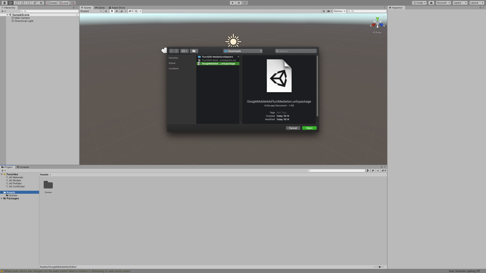
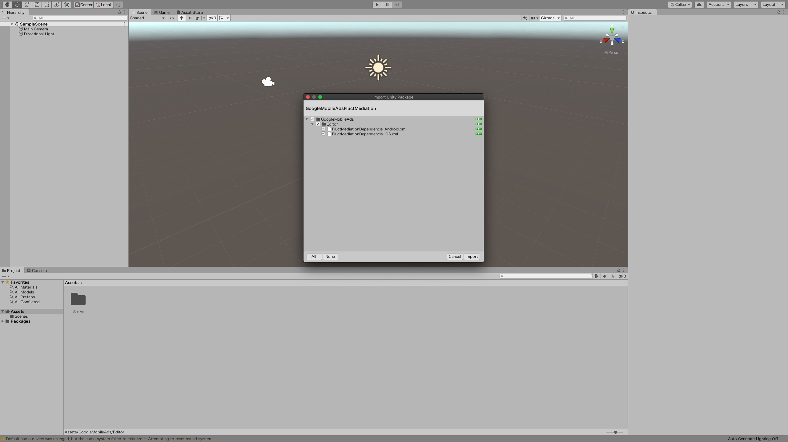

## AdMobのUnityプラグインを追加する
[スタートガイド](https://developers.google.com/admob/unity/start?hl=ja)を参照して、Unityプラグインをインポートしてください。

`v3.18.0`以上をご利用の場合は、`Assets` -> `Play Services Resolver` -> `Android Resolver` -> `Settings`を選び、`Use Jetifier`の項目にチェックを入れてください。

## アダプターを追加する

1. [最新のリリースページ](https://github.com/voyagegroup/FluctSDK-Unity/releases/latest)より`GoogleMobileAdsFluctMediation.unitypackage`をダウンロードしてください。

2. Unity のメニューから、 `Assets` -> `Import Package` -> `Custom Package...`の順番でクリックしてください。

3. ダウンロードした `GoogleMobileAdsFluctMediation.unitypackage`を選択してimportして下さい。

4. importされるファイルが選択できる画面が出るので、`import`を押してください。これで導入完了です。

