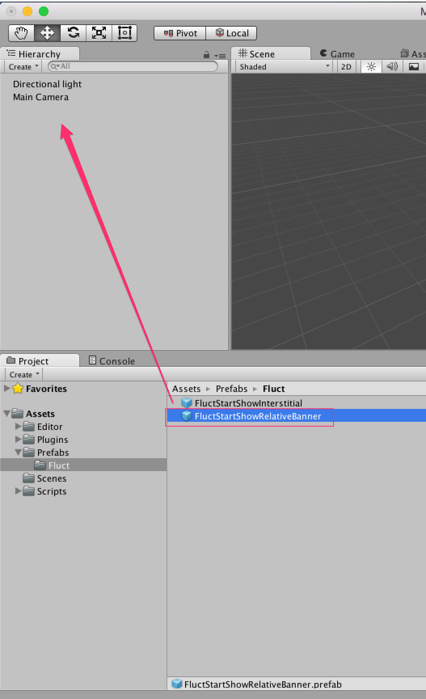
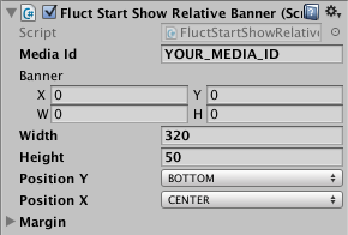

# バナー広告の実装
## Prefabで実装する場合

バナー表示の相対位置指定になります。

`Assets/Prefabs`にある`FluctStartShowRelativeBanner.prefab`をDrag&DropでSceneに追加します。



Inspectorでの設定



`YOUR_MEDIA_ID`の部分は発行された本番用`MediaID`を設定してください。

`Width`プロパティは`320`、`Height`プロパティは`50`以上の値を指定するようにして下さい。

`Position Y`と`Position X`は広告表示位置を設定することが可能で、デフォルトでは画面下部の中央寄せになっています。

`Position Y`は`TOP`,`CENTER`,`BOTTOM`、`Position X`は`LEFT`,`CENTER`,`RIGHT`の指定が可能です。

## コード実装する場合(実装例)

```
private FluctBanner banner;
void Start () {
  banner = gameObject.AddComponent<FluctBanner>();
  Rect rc = new Rect(0.0f, 0.0f, 320.0f, 50.0f);
  // 広告を表示する
  banner.Show(rc, "YOUR_MEDIA_ID");
}

void OnDestroy () {
  // 広告を非表示にする
  banner.Hide();
}
```

`YOUR_MEDIA_ID`の部分は発行された本番用`MediaID`を設定してください。
