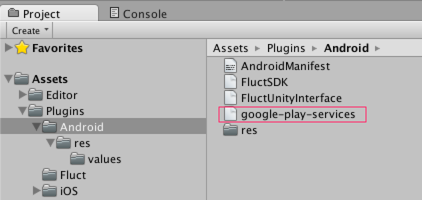
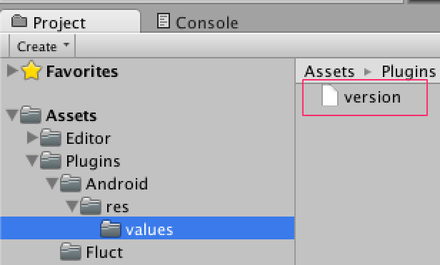

# FluctSDK-UnityPlugin 導入手順

## 対象Unity バージョン

Unity4.6 以上

### 対象OS

iOS5.1.1 以上 (armv7、armv7s、arm64)

Android2.3 以上

## 事前準備
### アカウントと広告枠の作成
[fluct管理画面](https://fluct.jp/login)にて広告枠を作成し、営業担当から`MediaID`を受け取って下さい。

### プラグインダウンロード
営業担当よりプラグインを受け取って下さい。

### Google Play Services ライブラリのインストール
Androidのプロジェクトを作成する場合、[Android SDK Manager](https://developer.android.com/tools/help/sdk-manager.html)を使用して、ライブラリを開発環境へインストールして下さい。

インストール手順は[公式情報](https://developers.google.com/android/guides/setup)を参照ください。

## プロジェクトへの導入
### パッケージのインポート
Unity のメニューから、 `Assets` -> `Import Package` -> `Custom Package...`の順番でクリックし、 `FluctSDK-UnityPlugin.unitypackage`を選択しして下さい。

インポート画面で`Import`をクリックして下さい。


この際、`AndroidManifest.xml`を既に作成している場合はインポートせず、[AndroidManifest.xmlの設定の案内](#androidmanifestxmlの設定)に従い、追加の設定をして下さい。

#### Unityプロジェクトにセットアップする


 [事前準備](#google-play-services-ライブラリのインストール)でインストールした`AndroidSDK`のパス以下にある

`<android-sdk>/extras/google/google_play_services/libproject/google-play-services_lib/libs/google-play-services.jar`

を、プラグインを利用するUnityプロジェクト以下の下記パスにコピーして下さい

`Assets/Plugins/Android/google-play-services.jar`



 また、 `<android-sdk>/extras/google/google-play-services/libproject/google-play-services_lib/res/values` 配下にあるversion.xmlを下記の階層を作成後にコピーします。 `Unityプロジェクト/Assets/Plugins/Android/res/values`



## 広告の表示設定
### バナー広告
#### Prefabで実装する場合

バナー表示の相対位置指定になります。

`Assets/Prefabs`にある`FluctStartShowRelativeBanner.prefab`をDrag&DropでSceneに追加します。


Inspectorでの設定


`YOUR_MEDIA_ID`の部分は発行された本番用`MediaID`を設定してください。

`Width`プロパティは`320`、`Height`プロパティは`50`以上の値を指定するようにして下さい。

`Position Y`と`Position X`は広告表示位置を設定することが可能で、デフォルトでは画面下部の中央寄せになっています。

`Position Y`は`TOP`,`CENTER`,`BOTTOM`、`Position X`は`LEFT`,`CENTER`,`RIGHT`の指定が可能です。

#### コード実装する場合(実装例)

```
private FluctBanner banner;
void Start () {
  banner = gameObject.AddComponent<FluctBanner>();
  Rect rc = new Rect(0.0f, 0.0f, 320.0f, 50.0f);
  // 広告を表示する
  banner.Show(rc, "YOUR_MEDIA_ID");
}

void OnDestroy () {
  // 広告を非表示にする
  banner.Hide();
}
```

`YOUR_MEDIA_ID`の部分は発行された本番用`MediaID`を設定してください。

### インタースティシャル広告

#### Prefabで実装する場合

Assets/Prefabsにある`FluctStartShowInterstitial.prefab`をDrag&DropでSceneに追加します。


Inspectorでの設定


`YOUR_MEDIA_ID`の部分は発行された本番用`MediaID`を設定してください。

#### コード実装する場合(実装例)

```
private FluctInterstitial interstitial;
void Start () {
  interstitial = gameObject.AddComponent<FluctInterstitial>();
}

void OnGUI () {
  if (GUI.Button(new Rect(180, 300, 200, 100), "ShowInterstitial")) {
    interstitial.ShowInterstitial("YOUR_MEDIA_ID");
  }
}
```

`YOUR_MEDIA_ID`の部分は発行された本番用`MediaID`を設定してください。

## 参考情報
### AndroidManifest.xmlの設定

packageからAndroidManifest.xmlをインポートしない場合はこちらの設定を行って下さい。
なお、下記２つのアクセス権限が既に記述されている場合は記述不要となります。

```
    <uses-permission android:name="android.permission.INTERNET"/>
    <uses-permission android:name="android.permission.ACCESS_NETWORK_STATE"/>
```

インタースティシャル広告を利用する場合は、Activityを記述してください。
なお、`android:theme`に関してはアプリの実装に沿った形で記述してください。

```
<activity
  android:name="jp.co.voyagegroup.android.fluct.jar.FluctInterstitialActivity"
  android:configChanges="orientation|keyboardHidden|screenSize"
  android:theme="@android:style/Theme.Translucent.NoTitleBar.Fullscreen"
  android:launchMode="singleTask"
  >
  <meta-data android:name="unityplayer.UnityActivity" android:value="true" />
  <meta-data android:name="unityplayer.ForwardNativeEventsToDalvik" android:value="true" />
</activity>
```

Google Play Serviceの設定を追加します。
下記のタグを<application>エレメントの子に追加します。
なお、既に記述されている場合は記述不要となります。

```
<meta-data android:name="com.google.android.gms.version"
           android:value="@integer/google_play_services_version" />
```

### Bitcodeについて(iOS)

現在FluctSDK-UnityPluginは`Bitcode`に対応していないため、出力したiOSプロジェクトのProjectSettingsから`ENABLAE_BITCODE`の値を`NO`に設定して下さい。
