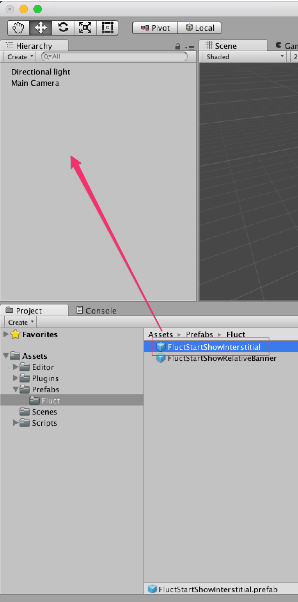
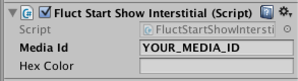

# インタースティシャル広告の実装

## Prefabで実装する場合

Assets/Prefabsにある`FluctStartShowInterstitial.prefab`をDrag&DropでSceneに追加します。



Inspectorでの設定



`YOUR_MEDIA_ID`の部分は発行された本番用`MediaID`を設定してください。

## コード実装する場合(実装例)

```
private FluctInterstitial interstitial;
void Start () {
  interstitial = gameObject.AddComponent<FluctInterstitial>();
}

void OnGUI () {
  if (GUI.Button(new Rect(180, 300, 200, 100), "ShowInterstitial")) {
    interstitial.ShowInterstitial("YOUR_MEDIA_ID");
  }
}
```

`YOUR_MEDIA_ID`の部分は発行された本番用`MediaID`を設定してください。

