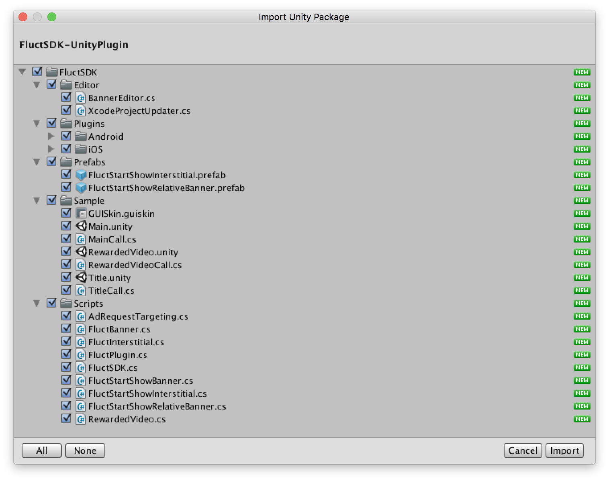

# FluctSDK-UnityPlugin 導入手順

## 対象Unityバージョン

* Unity 5.3.8 以上

## 対象OS

* iOS8.0 以上
* Android4.0 以上

## 事前準備
### アカウントと広告枠の作成
[fluct管理画面](https://fluct.jp/login)にて広告枠を作成し、営業担当から広告配信用のIDを受け取って下さい。

### プラグイン(FluctSDK-UnityPlugin.unitypackage)ダウンロード
[こちら](https://github.com/voyagegroup/FluctSDK-Unity/releases/latest)よりダウンロードして下さい。

### Google Play Services ライブラリのインストール
Androidのプロジェクトを作成する場合、Google Play Servicesを連携させる必要があります。  
Google Playストア内のアプリはデバイスの特定のために[Google広告ID](https://support.google.com/googleplay/android-developer/answer/6048248?hl=ja)を使うことが必須とされています。  
FluctSDKでGoogle広告IDを使うためには、[Google Play Services](https://developers.google.com/android/guides/setup)との連携が必要です。  

[Android SDK Manager](https://developer.android.com/tools/help/sdk-manager.html)を使用して、Google Play Servicesライブラリを開発環境へインストールして下さい。

インストール手順は[公式情報](https://developers.google.com/android/guides/setup)を参照ください。

## プロジェクトへの導入
### パッケージのインポート
Unity のメニューから、 `Assets` -> `Import Package` -> `Custom Package...`の順番でクリックし、 `FluctSDK-UnityPlugin.unitypackage`を選択しして下さい。

インポート画面で`Import`をクリックして下さい。



この際、`AndroidManifest.xml`を既に作成している場合はインポートせず、[AndroidManifest.xmlの設定の案内](#androidmanifestxmlの設定)に従い、追加の設定をして下さい。

#### Unityプロジェクトにセットアップする

 [事前準備](#google-play-services-ライブラリのインストール)でインストールした`AndroidSDK`に含まれるGoogle Play Servicesのライブラリを  
プラグインを利用するUnityプロジェクトに追加することで、FluctSDKとGoogle Play Servicesが連携されます。

- 追加するライブラリ
  - `play-services-base-x.y.z.aar`
  - `play-services-basement-x.y.z.aar`

  ※ x.y.zはライブラリのバージョン番号です。  
  下記のサンプルではバージョン9.6.1を使用しておりますが、導入時の最新版をご利用ください。  

- ライブラリの追加先  
  - `UnityProject/Assets/Plugins/Android/`

- Google公式の[unity-jar-resolver](https://github.com/googlesamples/unity-jar-resolver)の利用を推奨しています。

## 参考情報
### AndroidManifest.xmlの設定

packageからAndroidManifest.xmlをインポートしない場合はこちらの設定を行って下さい。
なお、下記２つのアクセス権限が既に記述されている場合は記述不要となります。

```
    <uses-permission android:name="android.permission.INTERNET"/>
    <uses-permission android:name="android.permission.ACCESS_NETWORK_STATE"/>
```

インタースティシャル広告を利用する場合は、Activityを記述してください。
なお、`android:theme`に関してはアプリの実装に沿った形で記述してください。

```
<activity
  android:name="jp.co.voyagegroup.android.fluct.jar.FluctInterstitialActivity"
  android:configChanges="orientation|keyboardHidden|screenSize"
  android:theme="@android:style/Theme.Translucent.NoTitleBar.Fullscreen"
  android:launchMode="singleTask"
  >
  <meta-data android:name="unityplayer.UnityActivity" android:value="true" />
  <meta-data android:name="unityplayer.ForwardNativeEventsToDalvik" android:value="true" />
</activity>
```

Google Play Serviceの設定を追加します。
下記のタグを<application>エレメントの子に追加します。
なお、既に記述されている場合は記述不要となります。

```
<meta-data android:name="com.google.android.gms.version"
           android:value="@integer/google_play_services_version" />
```
