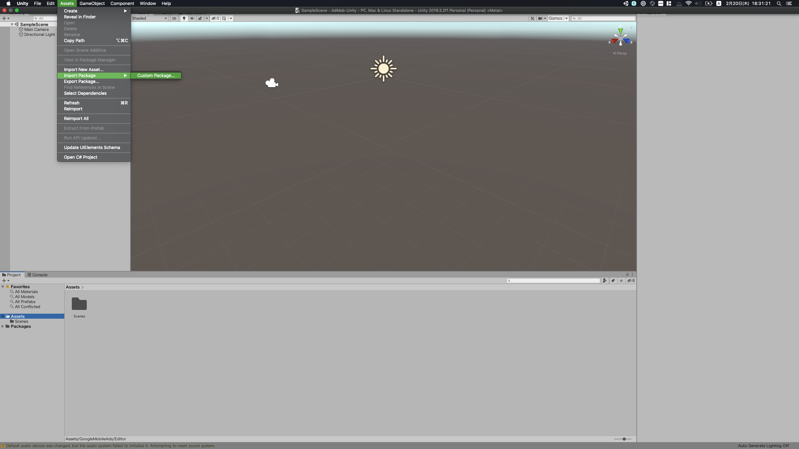
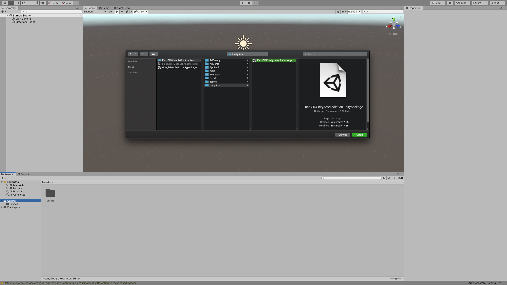
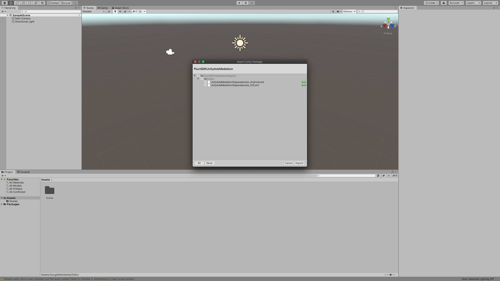

## メディエーションするアドネットワークSDKを追加する

弊社担当コンサルタントに指定されたアドネットワークの追加をお願いします。

## アダプターを追加する

1. [最新のリリースページ](https://github.com/voyagegroup/FluctSDK-Unity/releases/latest)より`FluctSDK-MediationAdapters.zip`をダウンロードして解凍してください。

2. Unity のメニューから、 `Assets` -> `Import Package` -> `Custom Package...`の順番でクリックしてください。

3. ダウンロードしたFluctSDK-MediationAdaptersディレクトリからメディエーションするアドネットワークのunitypackageを選択してimportしてください。

4. importされるファイルが選択できる画面が出るので、`import`を押してください。これで導入完了です。

